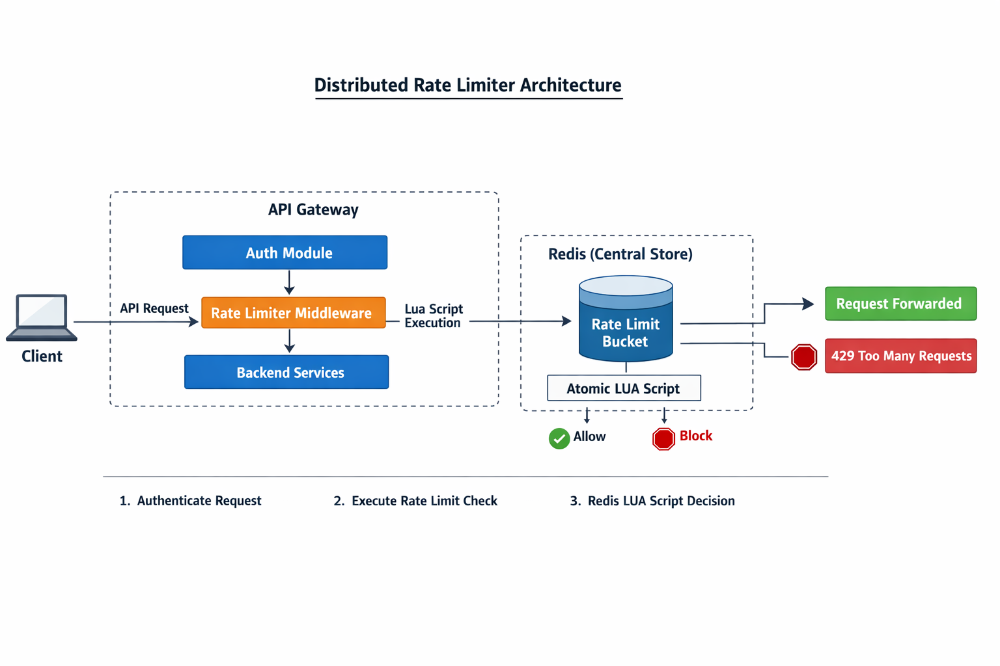

# Distributed Rate Limiter & API Gateway

## Overview
This project implements a **distributed API Gateway with a Redis-backed rate limiting system** designed to protect backend services from abuse, enforce fair usage across clients, and remain consistent in a horizontally scaled environment. The system follows **production-grade backend and distributed systems design principles**, focusing on correctness, scalability, and low-latency request handling.

---

I designed and implemented a **distributed rate limiter integrated into an API Gateway** to control and monitor API traffic in a scalable backend system.

The system:
- Enforces **rate limits across multiple API Gateway instances**
- Supports **per-user, per-API, and tier-based limits**
- Prevents backend overload during traffic spikes or abusive usage
- Provides centralized enforcement without compromising latency

This project addresses **infrastructure-level problems** commonly encountered in real-world backend systems rather than user-facing feature development.

---

### System Design
The system is designed as a **stateless API Gateway** backed by centralized shared state, allowing horizontal scalability and consistent enforcement.

### Core Components & Tech Stack

#### API Gateway (FastAPI)
- Built using **FastAPI** for high-performance asynchronous request processing
- Responsibilities:
  - Request authentication using JWT
  - Client identification (API key / user ID / IP)
  - Rate limit enforcement
  - Request routing to backend services
- Designed to be stateless to support horizontal scaling

#### Distributed Rate Limiter (Redis + Lua)
- **Redis** is used as a centralized in-memory store to maintain rate-limiting state
- Rate limiting is implemented using the **Token Bucket algorithm**, enabling:
  - Controlled burst handling
  - Smooth request throttling over time
- **Lua scripts** execute inside Redis to:
  - Atomically refill tokens
  - Consume tokens
  - Prevent race conditions under concurrent access
- Ensures consistent rate limiting across multiple gateway instances

#### Configuration Store (PostgreSQL)
- **PostgreSQL** stores:
  - Rate limit policies
  - API-specific configurations
  - User tiers
- Policies are dynamically resolved by the gateway, avoiding hardcoded limits

#### Infrastructure & Tooling
- **Docker & Docker Compose** for reproducible environments
- **Redis** for distributed shared state
- **PostgreSQL** for persistent configuration storage
- **Nginx** for reverse proxy and request forwarding
- Environment-based configuration using `.env` files

---

## Low-Level Design (LLD)

The diagram below illustrates the request flow and component interactions:

### Request Flow
1. Client sends a request to the API Gateway
2. Gateway authenticates and identifies the client
3. Rate limiter middleware executes a Redis Lua script
4. Redis atomically determines allow or deny
5. Allowed requests are forwarded to backend services
6. Rejected requests return `429 Too Many Requests`

This design ensures **low latency**, **distributed consistency**, and **concurrency safety**.

---

## What was the impact?

### Technical Impact
- Prevents backend services from being overwhelmed by excessive traffic
- Enforces **fair resource usage** across users and APIs
- Maintains **consistent rate limiting** across horizontally scaled gateway instances
- Adds minimal latency due to in-memory Redis operations
- Safely handles high concurrency using atomic execution

### Engineering Impact
- Mirrors how **real production API gateways** enforce traffic control
- Demonstrates distributed systems design, concurrency handling, and fault-awareness
- Emphasizes correctness, scalability, and operational reliability

